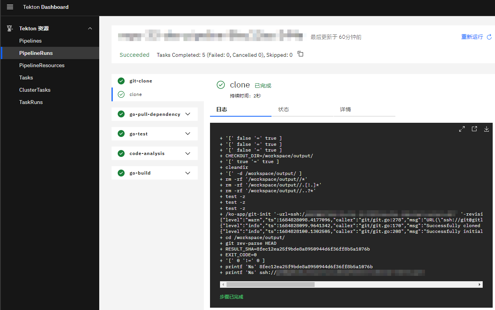
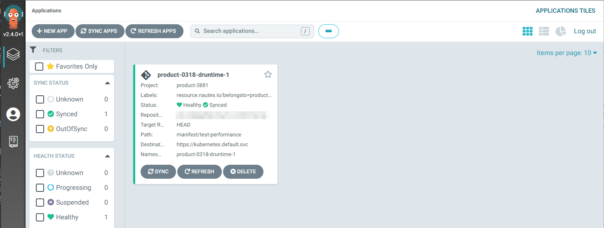

# View Pipeline and Deployment Results

Before starting this section, please ensure that you have read the [Main Process](main-process.md) section to understand the main process and related terminology for deploying applications in Nautes, and you have created at least one [pipeline runtime](project-pipeline-runtime.md#create-and-update-pipeline-runtime-api) or [deployment runtime](deployment-runtime.md#create-and-update-deployment-runtime-api).

You can view the execution results of the pipelines using the Tekton Dashboard and the image repository console, and view the deployment information of the applications using the ArgoCD console and the kubectl command line.

## View Pipeline Results

### View Resources in Tekton Dashboard

You can view the pipelines in the Tekton Dashboard installed in the runtime cluster by using a browser to access `https://$tekonHost:$traefik-httpsNodePort`.

> Replace the $tekonHost variable with the tekonHost address of the runtime cluster. For more information, refer to `spec.tekonHost` in the property template in the [Register Physical Cluster](run-a-pipeline.md#register-physical-cluster) or [Register Virtual Cluster](run-a-pipeline.md#register-virtual-cluster) section, for example, `tekton.vcluster-aliyun.8.217.50.114.nip.io`.
>
> Replace the $traefik-httpsNodePort variable with the traefik port of the runtime cluster. For more information, refer to `spec.traefik.httpsNodePort` in the property template in the [Register Physical Cluster](run-a-pipeline.md#register-physical-cluster) or [Register Virtual Cluster](run-a-pipeline.md#register-virtual-cluster) section, for example, `30443`.

When you access the Tekton Dashboard, if you haven't logged into the GitLab in the current browser session, the action will trigger unified authentication. During the authentication process, you need to enter your GitLab account and password to log in. After successful login, the page will automatically redirect to the Tekton Dashboard.

The Tekton Dashboard will present the namespaces authorized for you (with the same name as the pipeline runtimes) and their related resources, including pipelines, pipelineruns, tasks, taskruns, and pipelineresources, etc.

By clicking on a pipeline record, you can view YAML, create a pipelinerun, and view related pipelineruns. By clicking on a pipelinerun record, you can view the status, execution time, and running time of the pipelinerun, the parameters, status, logs, and YAML of the taskruns, and perform operations such as rerunning, starting and stopping, and deleting the pipelinerun.



### View Images in Image Repository

If the pipelines include tasks to build images and have been successfully executed, you can view the newly added images in the image repository (for example: `https://github.com/orgs/nautes-labs/packages`). To pull the images, you can use a similar command.

```shell
docker pull ghcr.io/nautes-labs/devops-sample:0.0.1-bdcdba83f17169db12e95bc9ff0592ace612016b
```

### View Image Configurations in Deployment Manifests

If the pipelines include tasks to update Kubernetes manifests and have been successfully executed, you can observe that the container image tags have been automatically updated to the versions containing the latest commit ID in the files within the deployment configuration repository (for example: `deployments/test/devops-sample.yaml`). The configuration snippet is as follows:

```yaml
spec:
  template:
    spec:
      containers:
        - name: ks-sample
          image: ghcr.io/nautes-labs/devops-sample:0.0.1-bdcdba83f17169db12e95bc9ff0592ace612016b
```

## View Deployment Results

### View Resources in ArgoCD

Access the ArgoCD console installed on the runtime cluster by using a browser to access `https://$argocdHost:$traefik-httpsNodePort`. Click `LOG IN VIA DEX` for unified authentication. If you haven't logged into GitLab in the current browser session, you'll need to enter your GitLab account and password to log in. After successful login, the page will automatically redirect to the ArgoCD console.

> Replace the $argocdHost variable with the argocdHost address of the runtime cluster. For more information, refer to `spec.argocdHost` in the property template in the [Register Physical Cluster](deploy-an-application.md#register-physical-cluster) or [Register Virtual Cluster](deploy-an-application.md#register-virtual-cluster) section, for example, `argocd.vcluster-aliyun-0412.8.217.50.114.nip.io`.
>
> Replace the $traefik-httpsNodePort variable with the traefik port of the runtime cluster. For more information, refer to `spec.traefik.httpsNodePort` in the property template in the [Register Physical Cluster](deploy-an-application.md#register-physical-cluster) or [Register Virtual Cluster](deploy-an-application.md#register-virtual-cluster) section, for example, `30443`.

The ArgoCD console lists ArgoCD applications related to products authorized for you, and you will be able to view and manage related resources. By clicking on an ArgoCD application card, you can view the resource manifest, YAML, events, logs, and perform operations such as synchronization, restart, and deletion. By clicking on "Settings" in the left menu bar of the ArgoCD console, you can also view ArgoCD projects related to authorized products.



### View Resources in Kubernetes

You can perform unified authentication using a standard OIDC client and obtain an ID Token, and use the ID Token as an authentication credential for kubectl to access Kubernetes as an authenticated user on the server.
The section describes how to perform unified authentication and obtain an ID Token using an example client provided by DEX.

You can obtain [the source code of the client](https://github.com/dexidp/dex/tree/master/examples/example-app), and compile the source code into a binary file. You can start the client using the following command, and the client will provide a WEB UI for unified authentication and return the authentication result.

```shell
./example-app \
 --client-id "$client_id" \
 --client-secret "$client_secret" \
 --issuer "$dex_url" \
 --issuer-root-ca "$dex_ca" \
 --listen "http://0.0.0.0:5555" \
 --redirect-uri "http://$ip:5555/callback" > /tmp/dex-client.log 2>&1 &
```

The variables `$client_id` and `$client_secret` are the client secrets issued by DEX, `$dex_url` is the service address of DEX, `$dex_ca` is the HTTPS certificate of DEX, and `$ip` is the IP address of the server where the client is running.

In order to access the client WEB UI, you also need to add an inbound rule for port `5555`. Visit the [ArgoCD of the Tenant Management Cluster](installation.md#check-the-installation-results) and add the redirect URI of the client under the `data.staticClients.id[0].redirectURIs` path in the `dex` ConfigMap of the `nautes` Application.

After the service is started, you can access the client on port `5555`, fill in the `Extra scopes` with `groups`, and click `Login` for unified authentication.


If authentication is successful, an ID Token will be generated, and the example is as shown below:

```Shell
eyJhbGciOiJSUzI1NiIsImtpZCI6IjA2OGUyODFmN2FkYTk2NjNmMWI0MTc0NGFhYTUzZDRmYjk0N2Q1YjMifQ.eyJpc3MiOiJodHRwczovL2RleC5ibHV6aW4uaW86OTA4MCIsInN1YiI6IkNnSXhNaElHWjJsMGJHRmkiLCJhdWQiOiJwbGF0Zm9ybSIsImV4cCI6MTY4MDg3Mjc2MiwiaWF0IjoxNjgwNzg2MzYyLCJhdF9oYXNoIjoiWTNNbnRHLTE3SERaWjNVb0hiNWdmUSIsImNfaGFzaCI6IlBGUXNEM1hPSkhNZ1B3RW1LNXl5bEEiLCJlbWFpbCI6ImxpdWp1bmhvbmdAdmlzcHJhY3RpY2UuY29tIiwiZW1haWxfdmVyaWZpZWQiOnRydWUsImdyb3VwcyI6WyJ5dW50aSIsIm5hdXRlcy1sYWJzIiwidGVrdG9uY2QiLCJkZXYtdGVuYW50IiwieXVudGkvc3ViZ3JvdXAiLCJ5dW50aS9zdWJncm91cC9zdWJzdWJncm91cCJdLCJuYW1lIjoibGl1anVuaG9uZyIsInByZWZlcnJlZF91c2VybmFtZSI6ImxpdWp1bmhvbmcifQ.AYiLwJMcVaJdVdF-j_RZnHCPpg1psF3CJlzlBzvBYcuI_t7slgRaumRmGJEYXHYn2QFxjEZCNnBiOpJDDJoitVTxi1qoZ2nNoxhB3Wtxc1MoqkiPR5wy49yHw5roTnqIuEBy5BMpN_embxB9vK1bwxf414PsYKm1Dhbj8dynpURjpTsLrN5k7zVC7RQxVvglNX4cgYEucvSLqMEdtHNlmtnRsl6DJuItxC0MYwXlp4C9FNWswUjSpargdX4wgqfYy91l66GiI2Xj_zdba0NHLcPean-nmBMObLNhxex4hj8IVcGyiEu9in87y8eisrCBoLEWP9SJ_ZxWiOPoTFr54A
```

You can use the ID Token to replace the authentication information in kubeconfig:

```yaml
# Replace the configuration of users in the kubeconfig file with the ID Token.
apiVersion: v1
clusters:
......
kind: Config
preferences: {}
users:
- name: user
  user:
    token: $ID-Token
```

If your runtime cluster type is virtual, you can obtain the kubeconfig file using the command line:

```Shell
# Replace the $VCLUSTER variable with the name of the virtual cluster.
kubectl get secret vc-$VCLUSTER-vcluster -n $VCLUSTER --template={{.data.config}} | base64 -d
```

After applying the kubeconfig file, you can use the kubectl command line to view the resources in the namespace with the same name as the deployment runtime, and you have management permissions for all resources in the namespace.

```Shell
# Apply the kubeconfig.
export KUBECONFIG=/opt/vcluster/kubeconfig-dex.yaml
# Use the kubectl command line to manage resources in the namespace. The following command lines are only examples.
kubectl get deployment -n deployment-runtime-1
kubectl delete deployment deployment-test -n deployment-runtime-1
```
