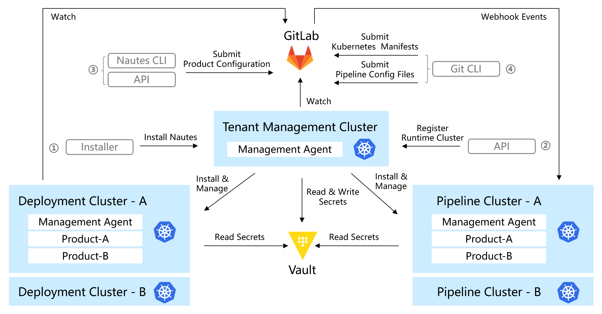

# Main Process

This document describes the main process of deploying an application, including the following steps:

[Installation](#installation)

[Register Runtime Cluster](#register-runtime-cluster)

[Prepare Runtime Environment](#prepare-runtime-environment)

[Deployment](#deployment)

[View Deployment Results](#view-deployment-results)

The main process is shown in the following diagram:

In Nautes, a tenant management cluster and runtime clusters are indispensable components. Each tenant has only one tenant management cluster, which is responsible for initializing all runtime clusters for the tenant and coordinating various components to integrate and deploy using the runtime cluster. Each tenant has only one Git-based configuration repository, and the tenant management cluster updates its components and resources automatically by watching the tenant configuration repository.

Each tenant can have multiple runtime clusters, which serve as the actual infrastructures for hosting IT system integration and running. These clusters can be either virtual or physical.

The environment refers to the collection of all infrastructure, software, and configurations that support the operation of IT systems at specific stages (such as development, testing, production, etc.). The runtime cluster can provide the computing power required by the environment. Therefore, it is necessary to relate the environment to the runtime cluster so that IT systems can use corresponding runtime clusters according to different stages.

In Nautes, for IT systems adopting a microservices architecture, a "Product" refers to an IT system, while a "Project" refers to a microservice. Therefore, each Product contains multiple Projects, each with its own independent code repository.

When a product is ready for integration or verification, the product team can use the specified pipeline runtime cluster for integration and testing by defining the pipeline runtime. Each project can have one or multiple exclusive pipeline runtimes, for example, code from different branches of a code repository can be integrated through different pipeline runtimes. Additionally, multiple pipeline runtimes can be hosted on the same cluster.

When a product is ready for deployment, the product team can deploy the product using a specified deployment runtime cluster by defining a deployment runtime. Each product can have multiple deployment runtimes, for example,You can manage functional testing and customer demonstration environments through two deployment runtimes in one product. Additionally, the deployment runtimes for multiple products can be hosted on the same cluster.

Nautes uses Kubernetes manifests to define environments, projects, code repositories, authorizations, deployment runtimes and stores these manifests in a product configuration repository, collectively referred to as the "product configuration manifest". Nautes synchronizes the pipeline or deployment runtime to the runtime cluster by watching changes in the product configuration manifest.

When users push code to the code repository declared in the pipeline runtime, Nautes will watch the webhook callbacks from the code repository and trigger a pipeline in the cluster declared in the pipeline runtime.

When users push Kubernetes manifests to the code repository declared in the deployment runtime, Nautes watches for changes in the Kubernetes manifests and synchronizes to the deployment runtime cluster until the actual state in the deployment runtime cluster is consistent with the expected state in the code repository.

To prevent the leakage of sensitive information, it is managed by Vault in Nautes.

## Installation

For more information, please refer to [Installation](installation.md).

## Register Runtime Cluster

You can register runtime clusters through the Command-Line or API.

If you choose to use the command-line, please refer to [Register Pipeline Runtime Cluster](run-a-pipeline.md#register-runtime-cluster) or [Register Deployment Runtime Cluster](deploy-an-application.md#register-runtime-cluster) according to the type of runtime cluster you want to register.

If you choose to use the API, please refer to [API](cluster.md).

## Prepare Runtime Environment

Submitting product configuration manifests supports both [Command-Line](deploy-an-application.md#prepare-runtime-environment) and API methods. For more information about the API, refer to the [Maintain Product](product.md), [Maintain Project](project.md), [Maintain Code Repository](code-repo.md), [Maintain Environment](environment.md), [Maintain Pipeline Runtime](pipeline-runtime.md), and [Maintain Deployment Runtime](deployment-runtime.md) sections.

When submitting product configuration manifests via the command-line, it sorts the contents of the manifest before executing. The order for adding is: create a product, create an environment, create a project, create a code repository, create an authorization, create a pipeline runtime, and create a deployment runtime. The order for destroying is: delete the deployment runtime, delete the pipeline runtime, delete the authorization, delete the code repository, delete the project, delete the environment, and delete the product.

After the product is created successfully, a group with the same name as the product will be created in GitLab, and a repository named `default.project` will be created in this group to store the product configuration manifests , including resource files for environments, projects, code repositories, authorizations, pipeline runtimes and deployment runtimes. Each group has only single `default.project` repository.

Nautes will automatically install related resources in the corresponding runtime cluster according to the product configuration manifests, enabling the pipeline runtime cluster to have the ability to watch webhook callbacks from GitLab and trigger the pipeline, as well as enabling the deployment runtime cluster to have the ability to watch the GitLab repository of the product and automatic deployment.

> In order to ensure that Nautes can automatically synchronize the runtimes of the product based on the product configuration manifests, the product configuration manifests must conform to the predefined rules. Therefore, when submitting a request, the Nautes API Server will perform validation on the product configuration manifests by default. If the validation fails, the request will be rejected.
>
> In certain scenarios, users may need to submit resource files failing to conform to the predefined rules, and subsequently submit the related resources later. In order to satisfy similar scenarios, you can force the submission of requests by adding the query parameter 'insecure_skip_check=true' to the API of POST and DELETE types.

## Run Pipelines

Use Git CLI to submit source code and pipeline configuration files to a project source code repository. After a successful submission, the pipeline will be triggered in the specified pipeline runtime cluster. For more information, please refer to [Run Pipelines](run-a-pipeline.md#run-pipelines)

## View Pipeline Results

You can view the execution results of the pipeline through Tekton Dashboard, GitLab console, and image repository console. For more information, please refer to [View Pipeline Results](pipeline-results.md).

## Deployment

After automatically updating (or manually updating using Git CLI) the Kubernetes manifests in the deployment configuration repository, Kubernetes manifests will be deployed to the specified deployment runtime cluster. For more information, please refer to [Deployment](deploy-an-application.md#deployment).

## View Deployment Results

Through the ArgoCD console or the kubectl command-line, you will be able to view the deployment results of the product and manage resources related to authorized products only. For more information, please refer to [View Deployment Results](deployment-results.md).
