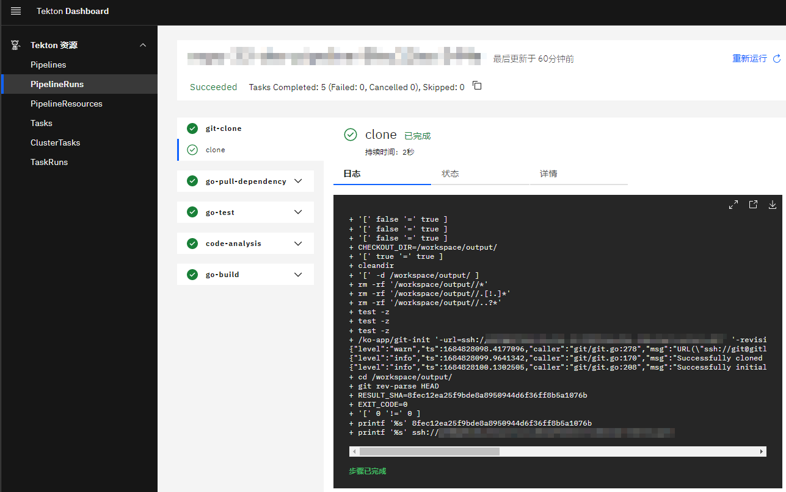
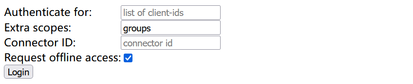

# 查看流水线和部署结果

在开始本节之前，请确保您已阅读 [主体流程](main-process.md) 章节，了解执行流水线和部署应用的主体流程和相关术语，并且已经创建了至少一个[流水运行时](project-pipeline-runtime.md#创建和更新流水线运行时api)或者[部署运行时](deployment-runtime.md#创建和更新部署运行时api)。

您可以通过 Tekton Dashboard 和镜像库控制台查看流水线的执行情况，通过 ArgoCD 控制台和 Kubectl 命令行查看应用的部署情况。

## 查看流水线

### 查看 Tekton Dashboard 中的资源

使用浏览器访问地址 `https://$tekonHost:$traefik-httpsNodePort`，可以访问安装在运行时集群中的 Tekton Dashboard 来查看流水线。

下载 [命令行工具](https://github.com/nautes-labs/cli/releases/tag/v0.4.1)，执行以下命令，查看 Tekton Dashboard 的访问地址。
```shell
./nautes get cluster -oyaml
```

> 替换变量 $tekonHost 为运行时集群的 tekonHost 字段的值，详情参考[注册物理集群](run-a-pipeline.md#注册物理集群)或者[注册虚拟集群](run-a-pipeline.md#注册虚拟集群)章节中属性模板的 `spec.componentsList.pipeline.additions.host`，例如：`tekton.vcluster-aliyun.8.217.50.114.nip.io`。
> 
> 替换变量 $traefik-httpsNodePort 为运行时集群的 traefik 端口，详情参考[注册物理集群](run-a-pipeline.md#注册物理集群)或者[注册虚拟集群](run-a-pipeline.md#注册虚拟集群)章节中属性模板的 `spec.componentsList.gateway.additions.httpsNodePort`，例如：`30443`。

当您访问 Tekton Dashboard 时，如果在当前浏览器会话中未登录过 Gitlab，访问动作会触发统一认证，认证过程中需要使用您的 GitLab 账号密码进行登录，登录成功后页面会自动跳转到 Tekton Dashboard。

Tekton Dashboard 将呈现被授权的命名空间（与流水线运行时同名）及其相关资源，包括 pipelines，pipelineruns，task，taskruns 和 pipelineresources 等资源。

点击某条 pipeline 记录，您可以查看 YAML、创建 pipelinerun、查看相关的 pipelinerun。点击某条 pipelinerun 记录，您也可以查看 pipelinerun 的状态、执行时间和运行时长，taskrun 的参数、状态、日志和 YAML 等，并对 pipelinerun 执行重新运行、启停、删除等操作。



### 查看镜像仓库中的镜像

如果流水线包括构建镜像的任务并且已正常执行完成，您可以在镜像仓库中（例如：`https://github.com/orgs/nautes-labs/packages`）看到新增的镜像信息，并可以通过类似命令拉取镜像：

```shell
docker pull ghcr.io/nautes-labs/devops-sample:0.0.1-bdcdba83f17169db12e95bc9ff0592ace612016b
```

### 查看部署清单的镜像配置

如果流水线包括更新 Kubernetes 资源清单的任务并且已正常执行完成，您可以在部署配置库的文件中（例如：`deployments/test/devops-sample.yaml`）看到容器的镜像标签已被自动修改为包含最新 commitid 的版本，配置片段如下：

```yaml
spec:
  template:
    spec:
      containers:
        - name: ks-sample
          image: ghcr.io/nautes-labs/devops-sample:0.0.1-bdcdba83f17169db12e95bc9ff0592ace612016b
```

## 查看部署结果

### 查看 ArgoCD 中的资源

使用浏览器访问地址 `https://$argocdHost:$traefik-httpsNodePort`，可以访问安装在运行时集群中的 ArgoCD 控制台。点击 `LOG IN VIA DEX` 进行统一认证，如果在当前浏览器会话中未登录过认证服务器（如 Gitlab），那么需要填写您的 GitLab 账号密码进行登录。登录成功后页面会自动跳转到 ArgoCD 控制台。

下载 [命令行工具](https://github.com/nautes-labs/cli/releases/tag/v0.4.1)，执行以下命令，查看 ArgoCD Dashboard 的访问地址。
```shell
./nautes get cluster -oyaml
```

> 替换变量 $argocdHost 为运行时集群的 argocdHost 地址，详情参考[注册物理集群](deploy-an-application.md#注册物理集群)或者[注册虚拟集群](deploy-an-application.md#注册虚拟集群)章节中属性模板的 `spec.componentsList.deployment.additions.host`，例如：`argocd.vcluster-aliyun-0412.8.217.50.114.nip.io`。
> 
> 替换变量 $traefik-httpsNodePort 为运行时集群的 traefik 端口，详情参考[注册物理集群](deploy-an-application.md#注册物理集群)或者[注册虚拟集群](deploy-an-application.md#注册虚拟集群)章节中属性模板的 `spec.componentsList.gateway.additions.httpsNodePort`，例如：`30443`。

在 ArgoCD 控制台中将呈现被授权产品相关的 ArgoCD applications，您可以查看和管理相关资源。点击某个 ArgoCD application 卡片，将呈现该 application 的资源清单，您可以查看某个资源的 YAML、事件、日志等，并对资源执行同步、重启、删除等操作。您也可以通过访问“设置/项目”页面来查看被授权产品相关的 ArgoCD Projects。


### 查看 Kubernetes 中的资源

您可以通过一个标准的 OICD 客户端进行统一认证以获取 ID Token，并将该 ID Token 作为 Kubectl 的认证凭证，再使用 Kubectl 以认证服务器上的身份访问 Kubernetes。下文描述了如何通过 DEX 官方提供的一个示例客户端进行统一认证并获取 ID Token。

您可以从[这里](https://github.com/dexidp/dex/tree/master/examples/example-app)获取该客户端的源码，并将源码编译为二进制文件。然后您可以通过以下指令启动这个客户端，客户端启动后会提供一个简单的 WEB UI 进行统一认证并返回认证结果。

```shell
./example-app \
 --client-id "$client_id" \
 --client-secret "$client_secret" \
 --issuer "$dex_url" \
 --issuer-root-ca "$dex_ca" \
 --listen "http://0.0.0.0:5555" \
 --redirect-uri "http://$ip:5555/callback" > /tmp/dex-client.log 2>&1 &
```

指令中的 `$client_id` 和 `$client_secret` 是 DEX 颁发的客户端密钥，`$dex_url` 是 DEX 的服务地址，`$dex_ca` 是 DEX 服务的 HTTPS 证书，`$ip` 是运行客户端的服务器IP。

为了能够访问客户端界面，您还需要开放入方向 `5555` 端口，并访问[租户管理集群的 ArgoCD](installation.md#查看安装结果)，在 `nautes` Application 的 `dex` Configmap 的 `data.staticClients.id[0].redirectURIs` 路径下，添加客户端的回调地址。

当服务启动后，您可以通过 `5555` 端口访问客户端，填写 `Extra scopes` 属性值为 `groups`，并点击 `Login` 进行统一认证。


认证成功后会生成如下的 ID Token：

```Shell
eyJhbGciOiJSUzI1NiIsImtpZCI6IjA2OGUyODFmN2FkYTk2NjNmMWI0MTc0NGFhYTUzZDRmYjk0N2Q1YjMifQ.eyJpc3MiOiJodHRwczovL2RleC5ibHV6aW4uaW86OTA4MCIsInN1YiI6IkNnSXhNaElHWjJsMGJHRmkiLCJhdWQiOiJwbGF0Zm9ybSIsImV4cCI6MTY4MDg3Mjc2MiwiaWF0IjoxNjgwNzg2MzYyLCJhdF9oYXNoIjoiWTNNbnRHLTE3SERaWjNVb0hiNWdmUSIsImNfaGFzaCI6IlBGUXNEM1hPSkhNZ1B3RW1LNXl5bEEiLCJlbWFpbCI6ImxpdWp1bmhvbmdAdmlzcHJhY3RpY2UuY29tIiwiZW1haWxfdmVyaWZpZWQiOnRydWUsImdyb3VwcyI6WyJ5dW50aSIsIm5hdXRlcy1sYWJzIiwidGVrdG9uY2QiLCJkZXYtdGVuYW50IiwieXVudGkvc3ViZ3JvdXAiLCJ5dW50aS9zdWJncm91cC9zdWJzdWJncm91cCJdLCJuYW1lIjoibGl1anVuaG9uZyIsInByZWZlcnJlZF91c2VybmFtZSI6ImxpdWp1bmhvbmcifQ.AYiLwJMcVaJdVdF-j_RZnHCPpg1psF3CJlzlBzvBYcuI_t7slgRaumRmGJEYXHYn2QFxjEZCNnBiOpJDDJoitVTxi1qoZ2nNoxhB3Wtxc1MoqkiPR5wy49yHw5roTnqIuEBy5BMpN_embxB9vK1bwxf414PsYKm1Dhbj8dynpURjpTsLrN5k7zVC7RQxVvglNX4cgYEucvSLqMEdtHNlmtnRsl6DJuItxC0MYwXlp4C9FNWswUjSpargdX4wgqfYy91l66GiI2Xj_zdba0NHLcPean-nmBMObLNhxex4hj8IVcGyiEu9in87y8eisrCBoLEWP9SJ_ZxWiOPoTFr54A
```

您可以使用这个 ID Token 替换 Kubeconfig 中的认证信息：

```yaml
# 将 ID-Token 替换 kubeconfig 文件中的 users 的配置
apiVersion: v1
clusters:
......
kind: Config
preferences: {}
users:
- name: user
  user:
    token: $ID-Token
```

如果您的运行时集群是一个虚拟集群，可以通过下面的命令行获取 Kubeconfig 文件。

```Shell
# 使用虚拟集群名称替换 $VCLUSTER 变量
kubectl get secret vc-$VCLUSTER-vcluster -n $VCLUSTER --template={{.data.config}} | base64 -d
```

应用 Kubeconfig 文件后，您可以通过 Kubectl 命令行查看与部署运行时相同名称的 Namespace 中的资源，您拥有该 Namespace 下所有资源的管理权限。

```Shell
# 应用 Kubeconfig
export KUBECONFIG=/opt/vcluster/kubeconfig-dex.yaml
# 使用 kubectl 命令行管理命名空间下的资源，以下命令行仅为示例
kubectl get deployment -n deployment-runtime-1
kubectl delete deployment deployment-test -n deployment-runtime-1
```
