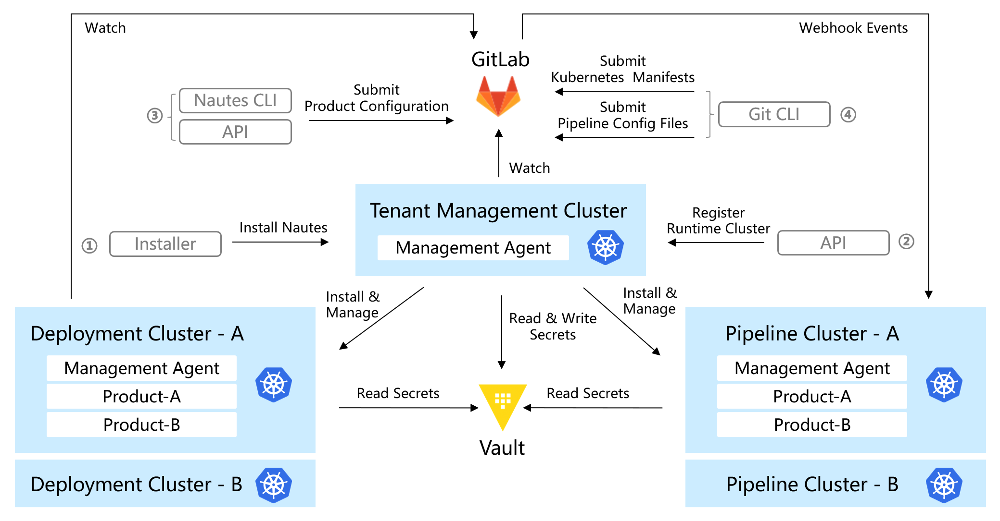

# 主体流程

本文档描述了部署一个应用的主体流程。包括以下步骤:

[安装](#安装)

[注册运行时集群](#注册运行时集群)

[初始化产品](#初始化产品)

[执行流水线](#执行流水线)

[查看流水线结果](#查看流水线结果)

[部署](#部署)

[查看部署结果](#查看部署结果)

主体流程如下图所示：

在 Nautes 中，租户管理集群和运行时集群是必不可少的组成部分。每个租户只有一个租户管理集群，负责初始化该租户所有的运行时集群，并协调各种组件，以使用运行时集群进行集成和部署。每个租户只有一个基于 Git 的租户配置库，租户管理集群通过监听租户配置库，自动更新自身的组件和资源。

每个租户可以拥有多个运行时集群，这些运行时集群是承载IT系统集成和运行的真正载体，可以是虚拟集群或者物理集群。

环境指的是支持特定阶段（如开发、测试、生产等）的 IT 系统运行的所有基础设施、软件和配置的集合。而运行时集群可以提供环境所需的计算能力，因此必须将环境与运行时集群相关联，以便 IT 系统可以根据不同阶段的需求使用相应的运行时集群。

在Nautes中，对于微服务架构的IT系统，“产品”表示一个IT系统，“项目”表示一个微服务。因此，一个产品包含多个项目，每个项目有独立的代码库。

产品进行到一定阶段时需要被集成、验证、或对最终用户提供业务功能，产品团队可以使用声明的方式来描述产品在不同环境中的预期状态。

当产品到了集成或验证阶段，产品团队可以通过定义流水线运行时来使用指定的流水线运行时集群对产品进行集成和测试。每个项目可以有一个或多个其独占的流水线运行时，例如，一个代码库不同分支的代码可以通过不同的流水线运行时进行集成。同时，相同的集群上也可以承载多个流水线运行时。

当产品到了部署阶段，产品团队可以通过定义部署运行时来使用指定的部署运行时集群对产品进行部署。每个产品可以包含多个部署运行时，例如，您可以在一个产品中通过两个部署运行时来管理功能测试和客户演示环境。同时，在相同集群上也可以承载多个产品的部署运行时。

Nautes 通过 Kubernetes 资源文件来定义环境、项目、代码库、权限和运行时，并将这些资源文件存储到产品配置库，资源文件的集合称为“产品配置清单”。Nautes 通过监听产品配置清单的变化向运行时集群同步流水线运行时或部署运行时。

当用户向流水线运行时中声明的代码库提交代码时，Nautes 会响应代码库的 Webhook 回调，并在流水线运行时中声明的集群中触发流水线的执行。

当用户向部署运行时中声明的代码库提交 Kubernetes 资源清单时，Nautes 会监听 Kubernetes 资源清单的变化并向部署运行时集群实施同步，直到部署运行时集群中的实际状态与代码库中的预期状态一致为止。

为了保护敏感信息不被泄露，Nautes 中的敏感信息均通过 Vault 管理。

## 安装

详情参考 [安装](installation.md)。

## 注册运行时集群

您可以使用命令行和 API 两种方式注册运行时集群。

如果您选择使用命令行，请根据要注册的运行时集群类型，参考 [注册流水线运行时集群](run-a-pipeline.md#注册运行时集群) 或 [注册部署运行时集群](deploy-an-application.md#注册运行时集群)。

如果您选择使用 API，请参考 [维护集群](cluster.md)。

## 初始化产品

提交产品配置清单支持命令行和 API 两种方式。使用 API 的方法参见 [维护产品](product.md)、[维护项目](project.md)、[维护代码库](code-repo.md)、[维护环境](environment.md)、[维护流水线运行时](pipeline-runtime.md)、[维护部署运行时](deployment-runtime.md) 章节。使用命令行的方法请参见 [流水线](run-a-pipeline.md#初始化产品) 或 [部署](deploy-an-application.md#初始化产品)。

使用命令行提交产品配置清单时，命令行会清单内容排序后再执行。正向新增的顺序是：创建产品、创建环境、创建项目、创建代码库、创建授权、创建流水线运行时、创建部署运行时。反向销毁的顺序是：删除部署运行时、删除流水线运行时、删除授权、删除代码库、删除项目、删除环境、删除产品。

产品创建成功后，将在 GitLab 中创建与产品同名的 group，并在这个 group 中创建名称为 `default.project` 的代码库，用于存储该产品的配置清单，包括环境、项目、代码库、权限、流水线运行时和部署运行时的资源文件。每个 group 有且只有一个 `default.project` 代码库。

产品配置清单创建成功后，Nautes 根据产品配置清单将在相应的运行时集群中自动安装相关资源，使得流水线运行时集群具备响应 GitLab 的 Webhook 回调并触发流水线执行的能力，以及让部署运行时集群具备监听产品的 GitLab 代码库和自动部署的能力。

> 为了保证 Nautes 基于产品配置清单能够自动同步产品的运行时，产品配置清单需要符合既定规则。因此提交 API 请求时，Nautes API Server 默认会对产品配置清单进行校验，如果校验不通过，则拒绝该请求。
>
> 在实际场景中，用户可能需要先提交不符合规则的资源文件，然后再补齐关联的资源。为了兼容类似场景，您可以通过为 POST 和 DELETE 类型的 API 接口添加 `insecure_skip_check=true` 查询参数来强制提交请求。

## 执行流水线

使用 Git CLI 向项目的源码库提交源代码和流水线配置文件。提交成功后，流水线会在指定的流水线运行时集群中被触发。详情参考 [执行流水线](run-a-pipeline.md#执行流水线)。

## 查看流水线结果

可以通过 Tekton Dashboard、GitLab 控制台、以及镜像库控制台查看流水线的执行结果，详细请参考 [查看流水线结果](pipeline-results.md)。

## 部署

通过流水线自动更新（或使用 Git CLI 手动更新）部署配置库中的 Kubernetes 资源清单后，Kubernetes 资源会被自动部署到指定的部署运行时集群。详情参考 [部署](deploy-an-application.md#部署)。

## 查看部署结果

可以通过 ArgoCD 控制台或者 kubectl 命令行查看产品的部署结果，并且只能查看和管理被授权产品的相关资源。详细请参考 [查看部署结果](deployment-results.md)。
